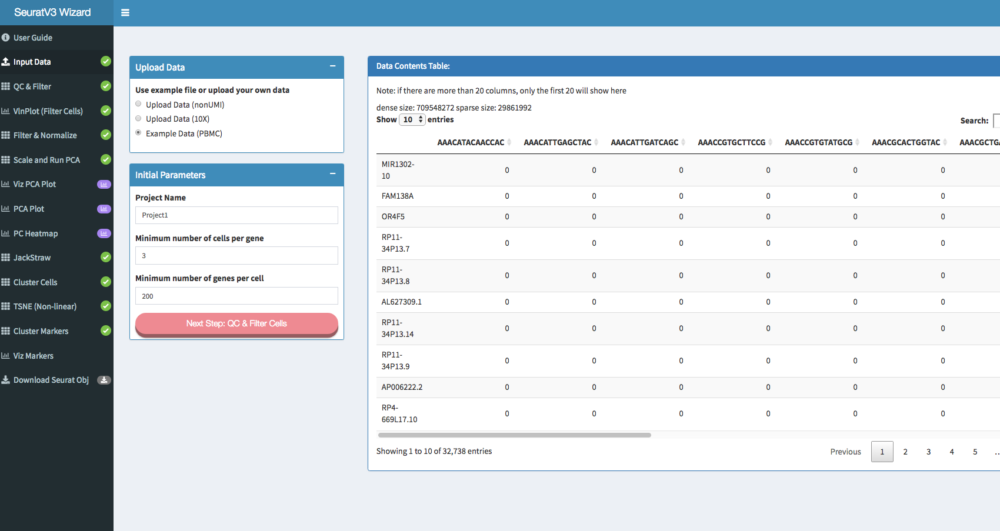
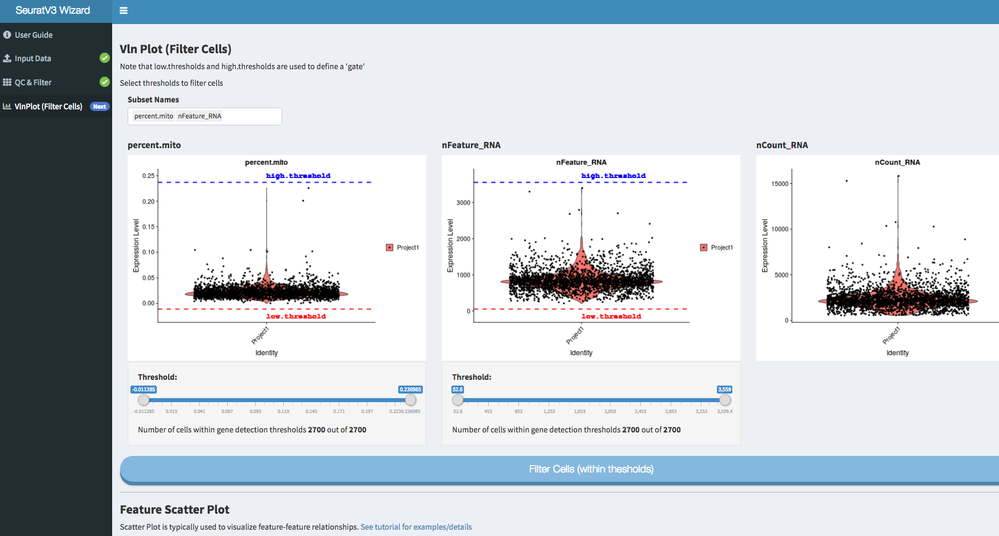
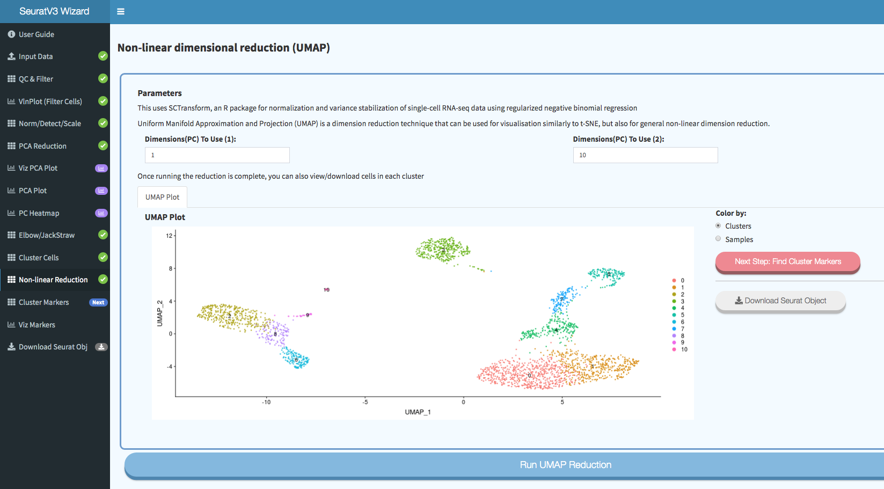
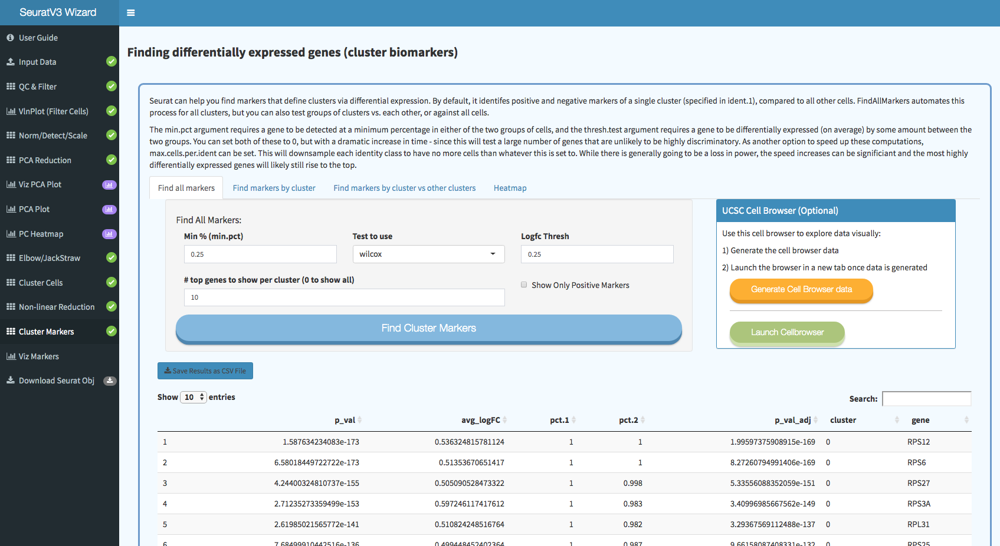

# SeuratV3Wizard: R Shiny interface for Seurat single-cell analysis library

## New Features:
Sep 5, 2019
- all plots can be downloaded
- file with multiple samples can be uploaded
- tsne and umap are both always calculated

- [Seurat v3](https://github.com/satijalab/seurat)
- [sctransform Option](https://github.com/ChristophH/sctransform)
- [UCSC Cellbrowser](https://github.com/maximilianh/cellBrowser)

## Online/Live instance:
You can try it online at http://nasqar.abudhabi.nyu.edu/SeuratV3Wizard

## Run using docker (Recommended):
Make sure Docker (version >= 17.03.0-ce) is installed.
```
docker run -p 80:80 aymanm/seuratv3wizard
```
This will run on port 80

To run on a different port:
```
docker run -p 8083:80 aymanm/seuratv3wizard
```
This will run on port 8083

## Local Install:
Make sure to have devtools installed first
```
devtools::install_github("nasqar/seuratv3wizard")
```

Optional: For ucsc cellbrowser support, make sure to follow the installation instructions [here](https://cellbrowser.readthedocs.io). For linux-based OS, type the following in the terminal:
```
sudo pip install cellbrowser=0.5.6
```
## Run:

```
library(SeuratV3Wizard)
SeuratV3Wizard()
```
This will run on http://0.0.0.0:1234/ by default
***

To run on specific ip/port:

```
ip = '127.0.0.1'
portNumber = 5555
SeuratV3Wizard(ip,portNumber)
```
This will run on http://127.0.0.1:5555/

## Screenshots:








## Acknowledgements:

- Rahul Satija, Andrew Butler and Paul Hoffman (2017). Seurat: Tools for Single Cell Genomics. R package version 2.2.1\. [https://CRAN.R-project.org/package=Seurat](https://CRAN.R-project.org/package=Seurat)

- [Satija Lab](http://satijalab.org/seurat/)

- [Christoph Hafemeister, Rahul Satija (2019). Normalization and variance stabilization of single-cell RNA-seq data using regularized negative binomial regression](https://github.com/ChristophH/sctransform)

- [UCSC Single Cell Browser](https://github.com/maximilianh/cellBrowser)
