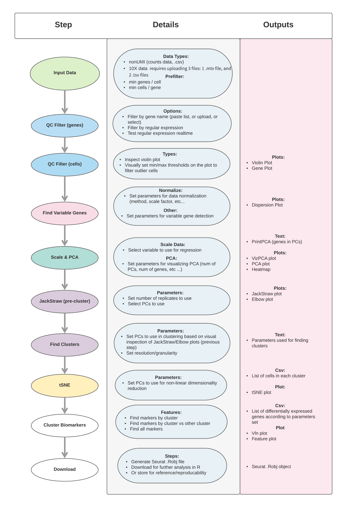
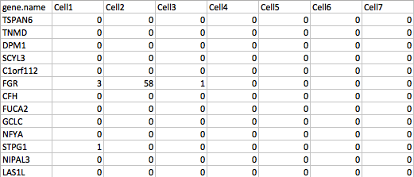

## **Introduction**

---

This is a web-based interactive (wizard style) application to perform a **guided single-cell RNA-seq data analysis and clustering** based on <a href="https://satijalab.org/seurat/" target="_blank"><strong>Seurat</strong></a>. 

The wizard style makes it intuitive to go back between steps and adjust parameters based on different outputs/plots, giving the user the ability to use feedback in order to guide the analysis iteratively.

It is meant to provide an intuitive interface for researchers to easily **upload, analyze, visualize, and explore single-cell RNA-seq data** interactively with no prior programming knowledge in R.

It is based on <a href="https://satijalab.org/seurat/" target="_blank"><strong>Seurat</strong></a>, an R package designed for QC, analysis, and exploration of single cell RNA-seq data.

The application follows the <a href="https://satijalab.org/seurat/pbmc3k_tutorial_v3.html" target="_blank">Seurat - Guided Clustering Tutorial</a> <link> workflow closely. It also provides additional functionalities to further explore and visualize the data.

See **Figure 1** below for a diagram that outlines all the workflow steps and their expected output

<strong><em>Figure 1: Workflow (Click figure to enlarge)</em></strong>

<a href="#" class="pop">
    

    
    

</a>

  

    
              
      

      	<button type="button" class="close" data-dismiss="modal">&times;Close</button>
        
      

    

  

## **Input Data Types**

---

This application accepts the following types of input data:

### 1. Example data (Demo):

- For demo purposes, you can select "Example data"

- That will automatically load the PBMC data used in the <a href="https://satijalab.org/seurat/pbmc3k_tutorial_v3.html" target="_blank">tutorial</a>

- You can follow the steps afterwards to run the analysis mirroring the tutorial in order to get familiar with the app

### 2. Upload your own data (gene counts):

<ul>
<li>
A .csv/.txt file that contains a <strong>table of the gene counts</strong>
</li>
<li>
The first column should have gene names/ids followed by columns for sample counts. The file can be either <strong>comma or tab delimited</strong>
</li>
<li>
If your counts are not merged, you can use this <a href="http://nasqar.abudhabi.nyu.edu/countMerger">Count Merger</a> to consolidate all your sample count files
</li>
<li>
Make sure cell/column names do <strong>NOT contain underscores _</strong> unless they are <strong>replicates</strong>
</li>
<li>
For replicates, denote column names with underscore plus the replicate number (eg. Sample_1)
</li>
<li>
First column can either contain gene.ids or gene.names
</li>
<li>
For a sample file, click <a href="www/sampleCounts.csv" target="_blank">here</a>
</li>
</ul>

<strong><em>Figure 2: Eg. counts file</em></strong>

    

### 2. 10X data

- This option requires uploading 3 files: 1 .mtx file, and 2 .tsv files

- See the example in the <a href="https://satijalab.org/seurat/pbmc3k_tutorial_v3.html" target="_blank">tutorial</a>, or click <a href="https://s3-us-west-2.amazonaws.com/10x.files/samples/cell/pbmc3k/pbmc3k_filtered_gene_bc_matrices.tar.gz">here</a> to download the PBMC data.

## **Run Results**
---
### 1. Data Output
There will be plenty of output information from major steps, some of which will be displayed and/or downloadable
- Genes in PCs
- List of cells in each cluster
- List of differentially expressed genes
- Seurat Object (.RObj) containing all steps and computed data output

### 2. Visualization
Various forms of visualizations are included:
* **QC/Filter**
    * Violin Plot
    * Gene Plot
    * Dispersion Plot
* **Dimensionality Reduction**
    * PCA Plot
    * Heatmap
* **Clustering**
    * Jackstraw / Elbow Plots
    * tSNE Plot
* **Gene Expression**
    * Violin Plot
    * Feature Plot

## **Acknowledgements**
---
- Rahul Satija, Andrew Butler and Paul Hoffman (2017). Seurat: Tools for Single Cell Genomics. <a href="https://CRAN.R-project.org/package=Seurat" target="_blank">https://CRAN.R-project.org/package=Seurat</a>
- <a href="http://satijalab.org/seurat/" target="_blank">Satija Lab</a>
- <a href="https://github.com/ChristophH/sctransform" target="_blank">Christoph Hafemeister, Rahul Satija (2019). Normalization and variance stabilization of single-cell RNA-seq data using regularized negative binomial regression</a>
- <a href="https://github.com/maximilianh/cellBrowser" target="_blank">UCSC Single Cell Browser</a>

---

